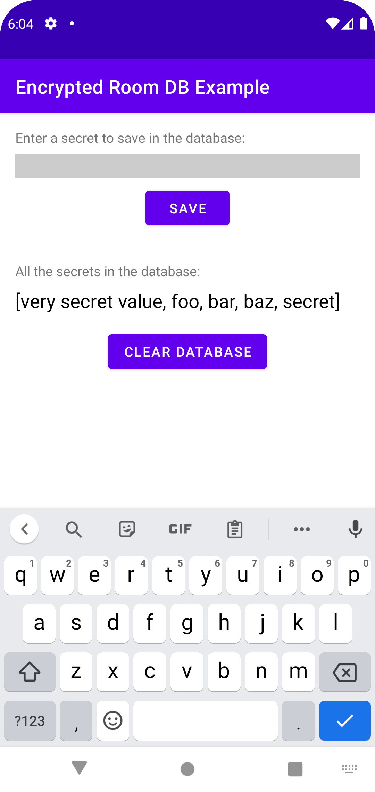
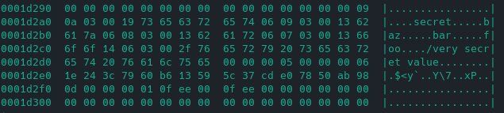

# About
This repository contains a sample app that shows how to encrypt the room database in an Android app.
The password used for encryption is generated on the first use
and is saved in the Android EncryptedSharedPreferences.

## Room Database Without Encryption
The branch `no-encryption` in this repository contains the source code of the app
without the room database being encrypted.



By analyzing the database file with `hexdump` it is possible to verify that the database is not encrypted.
```shell
hexdump -C secret-database.db-wal
```


